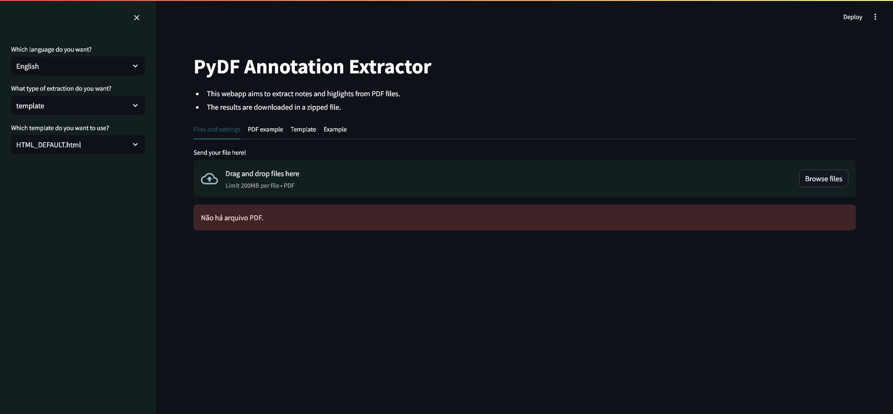

[](README.md)

Este projeto é uma versão web do [PyDFannots](https://github.com/pho-souza/PyDFannots/).

# Pré-requisitos

Este aplicativo utiliza as bibliotecas PyMuPDF e Jinja2 para extrair anotações e destaques de arquivos PDF.

Para a interface web, ele utiliza a biblioteca Streamlit.

Para instalar os pacotes necessários em Python, use:

```bash
pip install -r requirements.txt
```

# Como usar

Existem duas maneiras de executar o PyDFannots Web:

```bash
streamlit run app.py
```

Ou

```bash
python -m streamlit run app.py
```

O aplicativo abrirá uma página no seu navegador.



Depois de fazer o upload dos seus arquivos PDF na área designada, você pode definir o método de extração (template, json ou csv).

Se você escolher o template, terá que selecionar um template. Por padrão, existem quatro templates:
- HTML_DEFAULT.html
- HTML_DEFAULT_pt_BR.html
- MARKDOWN_DEFAULT.html
- MARKDOWN_DEFAULT_pt_BR.html

A aba **Exemplo** mostra como as anotações e destaques na aba **PDF de Exemplo** aparecerão após a extração.

Você pode criar novos templates usando [jinja2](https://jinja.palletsprojects.com/en/3.1.x/) e colocá-los na pasta:

> app/templates

# Templates

## Como criar templates?

O PyDFannots usa a linguagem de templates [Jinja2](https://jinja.palletsprojects.com/en/3.1.x/).

Você pode criar templates básicos usando a seguinte estrutura:

```jinja2

...ações...

```

Você pode acessar o destaque usando a notação de ponto. A lista de variáveis em cada destaque está listada na [estrutura de anotação](https://github.com/pho-souza/PyDFannots/blob/main/doc/Annotation_Structure.md) no repositório PyDFannots.
O exemplo a seguir usa annotation como a anotação atual no loop. text é um campo de anotação.

```jinja2

{{annotation.text}}

```

Você pode acessar todos os campos desta maneira:

```jinja2

{{annotation.content}}
{{annotation.text}}
{{annotation.page}}
...etc...

```
