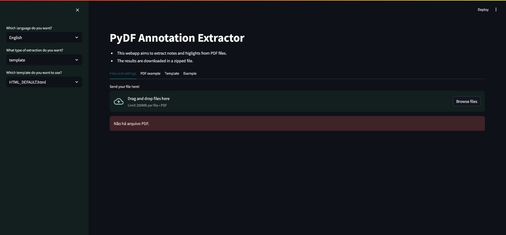

[](README.pt-br.md)

This project is a web version of [PyDFannots](https://github.com/pho-souza/PyDFannots/).

# Prerequisites

This application uses the PyMuPDF and Jinja2 libraries to extract notes and highlights from PDF files.

For the web interface, it utilizes the Streamlit library.

To install the required Python packages, use:

```bash
pip install -r requirements.txt
```

There are two ways to execute PyDFannots Web:

```bash
streamlit run app.py
```

Or

```bash
python -m streamlit run app.py
```

# How to use

The application will open a page in your browser.



After uploading your PDF files in the designated area, you can set the extraction method (template, json, or csv).

If you choose the template, you'll need to select a template. By default, there are four templates:
- HTML_DEFAULT.html
- HTML_DEFAULT_pt_BR.html
- MARKDOWN_DEFAULT.html
- MARKDOWN_DEFAULT_pt_BR.html

The **Example** shows how the notes and highlights in the **PDF example** tab will appear after extraction.

You can create new templates using [jinja2](https://jinja.palletsprojects.com/en/3.1.x/) and place them in the folder:

> app/templates

# Templates

## How to make templates?

PyDFannots uses the [Jinja2](https://jinja.palletsprojects.com/en/3.1.x/templates/) templating language.

You can create basic templates using the following structure:

```jinja2

...actions...

```

You can access the highlight using **dot** notation. The list of variables in each highlight is listed in in [annotation structure](https://github.com/pho-souza/PyDFannots/blob/main/doc/Annotation_Structure.md) in the PyDFannots Repo.
The following example uses ``annotation`` as the current annotation in the loop. ``text`` is one field of annotation.

```jinja2

{{annotation.text}}

```

You can access all the fields this way:

```jinja2

{{annotation.content}}
{{annotation.text}}
{{annotation.page}}
...etc...

```


